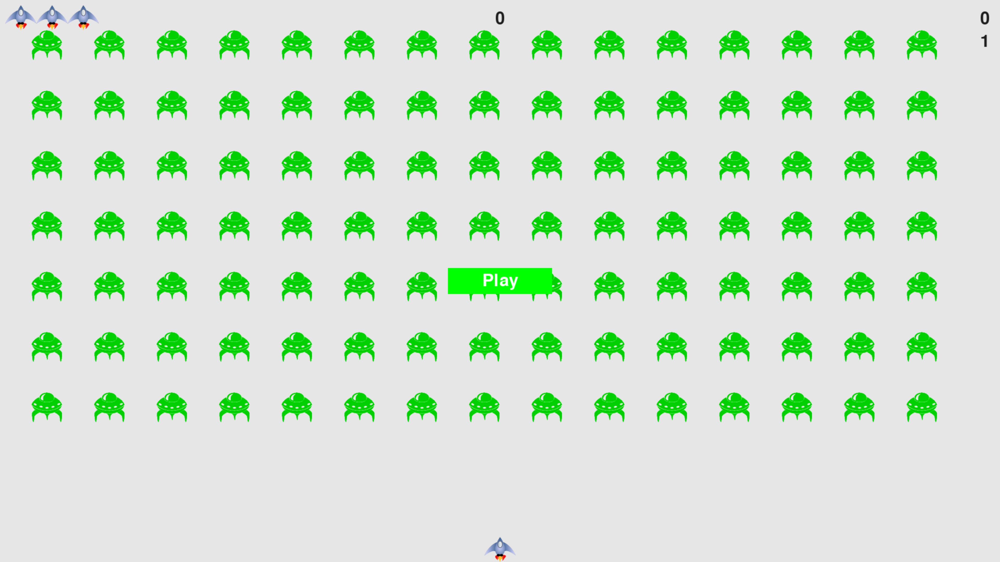
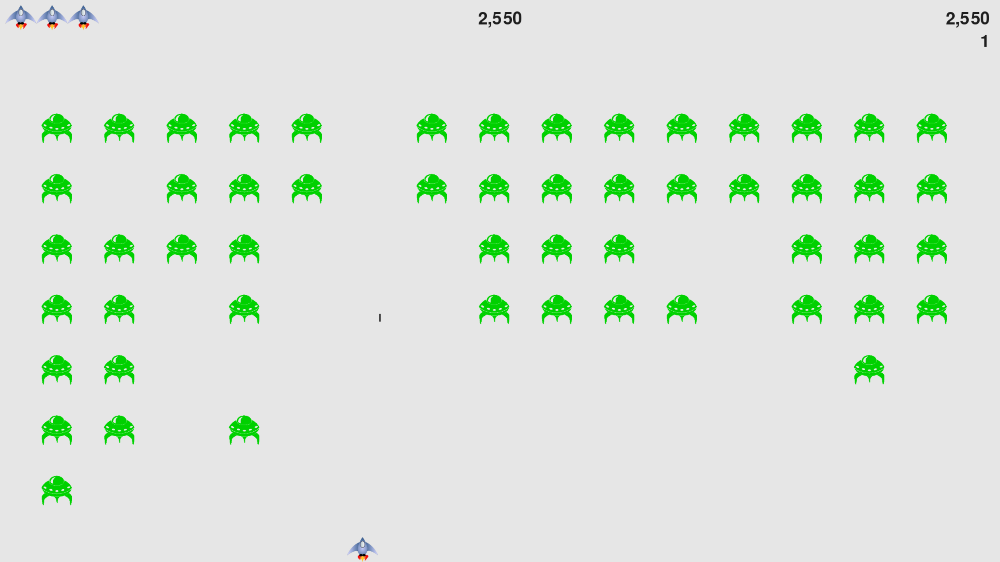

# Alien Invasion
## Introduction
This project is a learning matrial from the book *Python Crash Course* written by *Eric Matthes*.
## How to build
1. Install pygame
```
python -m pip install --user pygame
```
or
```
python3 -m pip install --user pygame
```
2. Run this game
```
python3 alien_invasion.py
```
## Main features
1. Play button
2. Ship shoots bullets(settings.py sets bullet number to be 3) to hit fleet of aliens.
3. Level up: After a fleet of aliens has been hitted, the speed of aliens increase. Level is shown in right corner of the screen under score.
4. Score: Score increase every time when an alien has been hit. Level is shown in right corner of the screen under score.
5. High socre
6. Ships
## Screenshots
<h1 align="center">

</h1>
<h1 align="center">

</h1>
## New features added by me
1. All-Time High Score